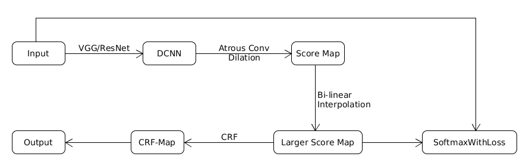
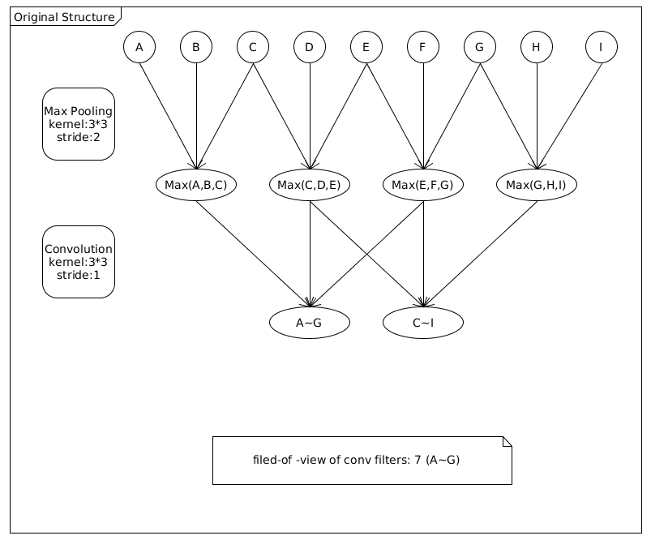
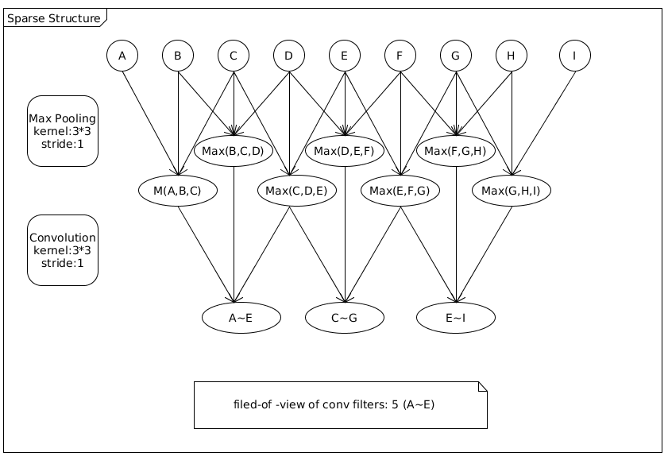
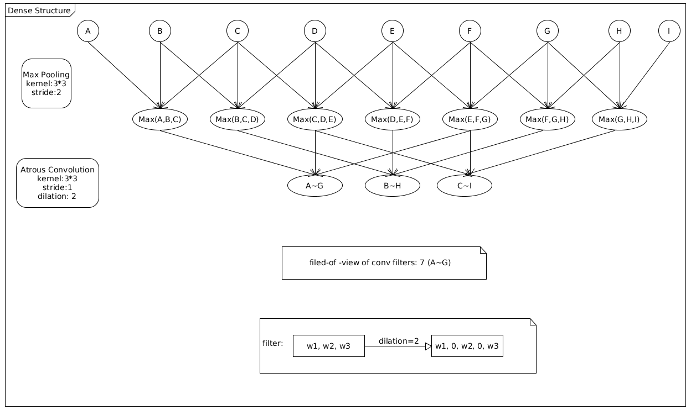

## DeepLab
__Abstract__: __Deep Convolutional Nets &#160; Atrous Convolution &#160; Fully Connected CRFs__

[Link](https://arxiv.org/pdf/1606.00915.pdf)

### 1. Overall Archetecture

### 2. Models
#### 2.1 DCNN && Atrous Convolution

* __*DCNN*__

 We adopt __*VGG16*__ and __*ResNet101*__ to extract feature. And we repalce their fully-connected layers with fully-convolutional layers.

* __*Atrous Convolution*__

Atrous Convolution allows us to compute feature maps more densely and enlarge the $field-of-view$ of filters.

First, consider one-dimensional signals.

Obviously. we can see __*Atrous Convolution*__ helps to resize a 3-dimensional filter to a 5-dimensional one, in fact. Compared with __*Original Structure*__, we attain mere resolution enhancement due to 1 stride in __MAX Pooling Layer__. Compared with __*Sparse Structure*__, the field-of-view of filters can be enlarged to the same as __*Original Structure*__.

By the way, when dilation=1(rate is refered to as dilation in papaer), __*Dense Structure*__ and __*Sparse Structure*__ are the same.

In conclusion, given a $k*k$ filter, Atrous Convolution can enlarge the kernel size from $k$ to $k_e=k + (k-1)*(dilation-1)$ without increasing the number of parameters.

#### 2.2 Atrous Spatial Pyramid Pooling(2 approaches) 
##### 2.2.1 Standard MultiScale Processing
* Three rescaled versions of the original image.
* Three parallel DCNN branches share the same parameters.
* Bilinearly interplote the feature maps to the original image resolution.
* Fuse 3 branches by taking maximum.

##### 2.2.2 Different sampling rates
* Employ multiple parallel atrous convolutional filters with different rates(dilations).
* Fuse them by taking SUM

#### Let's take VGG16 as an example:
#### 2.3 CRF