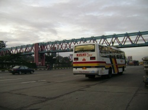
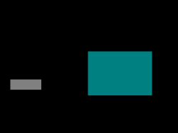
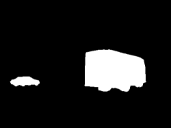
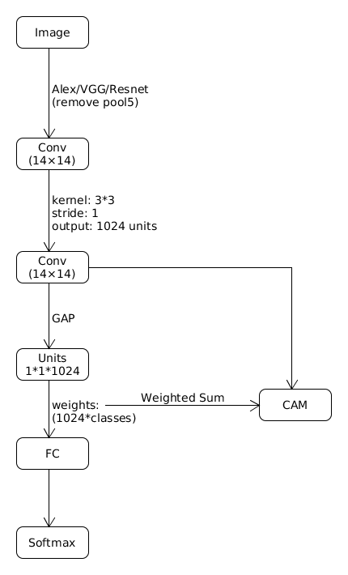
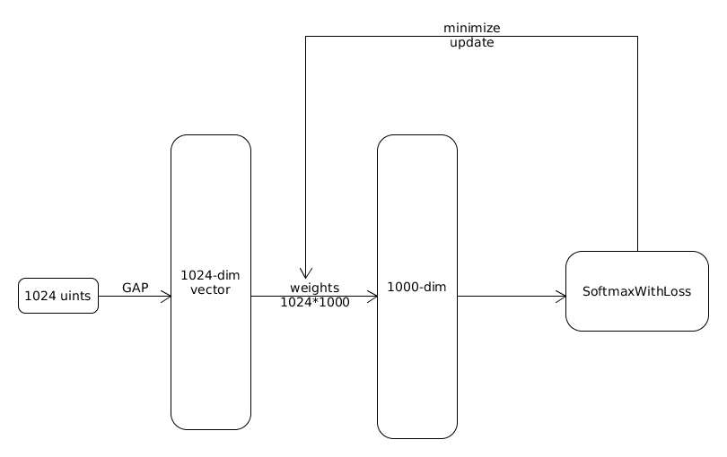

## 1. What is _Weakly Supervised Learning_

### 1.1 Localization
Labels in <em>__Weakly__</em> Supervised Learning: __image-level class__

| Image | Label | 
| :-: | :-: |  
|  | __Vehicle__ | 

Labels in __fully__ Supervised Learning: __bbox-level__

| Image | Label | 
| :-: | :-: |  
|  |  | 

### 1.2 Segmentation
Labels in <em>__Weakly</em>__ Supervised Learning: image-level class,  bbox-level

| Image | Label | 
| :-: | :-: |  
|  | __Vehicle__  or  | 

Labels in __fully__ Supervised Learning: __pixel-level__

| Image | Label | 
| :-: | :-: |  
|  |  | 

## 2. Why _Weakly Supervised Learning_

Obviously, easier to get data, however, lower accuracy.
_______________________________________________________________________________

# Paper

## I. Learning Deep Features for Discriminative Localization
Abstract: __GAP__(Global Average Pooling)  &#160;  __CAM__(Class Activation Mapping)

[Link](http://www.cv-foundation.org/openaccess/content_cvpr_2016/papers/Zhou_Learning_Deep_Features_CVPR_2016_paper.pdf)

### 1. Overall Archetecture

### 2. Class Activation Mapping
In the last convolutional layer($H*W*1024$), and given a unit k, we can get a  scalar $F$$k$ $(F_k = Avg(\sum_{x,y}{f_k(x, y)})$ after performing __Global Average Pooling__. 

So given 1024 units, we can get a 1024-dim vector $F$. In the next fully-connected layer(the input to the softmax), we can get score for class c: $S_c = w^cF$ .

And with the predicts and labels, we can compute loss using SoftmaxWithLoss, and minimize the loss we can get __optimal parmeter $w$__. 

The process is as follows:

For the class c, we compute _CAM_ via $M_c = \sum_{k}{w_k^cf_k(x,y)}$

### 3. Localization(threshold(阈值), largest connected component（最大连通区域）and upsample)
According to the Classification, we select top-5(or top-1) predicted categories and we get 5(or 1) Class Activation Maps.

We use a simple thresholding technique to segment the heatmap. We first segment the regions of which the value is above 20% of the max value of the CAM. Then we take the bounding box that covers the largest connected component in the segmentation map. Finally we should resize the map to the same size of input.

---
title: WSL
date: 2017-09-17 22:26:27
tags:
---
